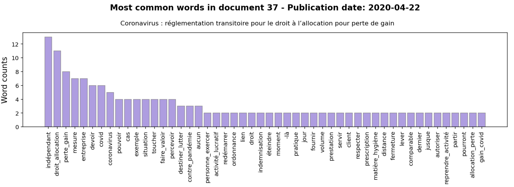
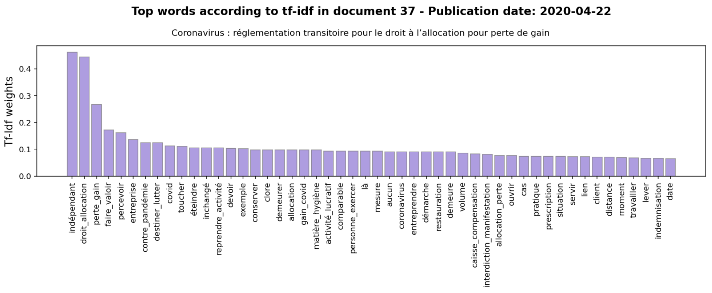
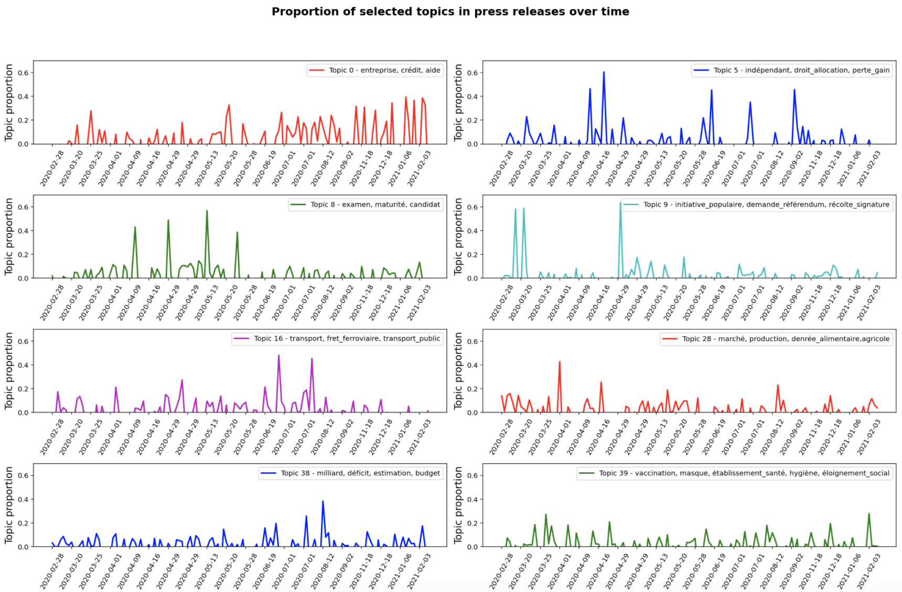

# Topic Analysis

In this notebook, I explored various topic analysis techniques using texts in French.

I used the press releases in French by the Swiss Federal Council about the Coronavirus epidemic ([source](https://www.admin.ch/gov/fr/accueil/documentation/communiques/communiques-conseil-federal.html?dyn_startDate=01.01.2015&dyn_pageIndex=1)). I collected press releases dating from February 2020 to February 2021 mentioning the term "Corona" in their title.

My goal is to find the "main topics" or "underlying ideas" in each press release available in the corpus. For example, in this particular corpus about the Coronavirus epidemic, possible topics could be "establishing border controls", "banning gatherings and large scale events", or "providing financial assistance to companies". 

I explored different techniques such as word frequencies, weighted word frequencies, and latent semantic analysis (PCA).

Here are the steps that I followed in this notebook:

1. Text cleaning using spaCy
2. Topic Analysis
    * Word frequencies
    * Weighted word frequencies (tf-idf)
    * Latent Semantic Analysis (PCA)
3. Topic evolution over time

## Keyphrase extraction

Keyphrase extraction is a simple approach to topic analysis. It involves extracting the most common words and phrases and checking whether they capture underlying concepts or themes in a document or corpus.

I explored the following approaches:

* word frequencies
* weighted word frequencies.

### Word frequences

We can also look at the most frequent words in a single document.

### Tf-idf: Weighted word frequencies

Above, I focused on raw word counts. However, the most frequent words in a document aren't necessarily the most informative and could be shadowing other rarer yet more interesting terms. I will now re-weight word frequencies using the inverse term frequency or idf from the Tf-idf model.

### Latent Semantic Analysis (PCA)

PCA is generally used to compress data into fewer dimensions. But, of course, it doesn't "understand" what topics are or what each word means. However, when it sees words such as: "entreprise", "crédit"', "aide", "milliard", etc., appear together a lot in texts, then it groups them. PCA will group terms that appear a lot together in a document and in the corpus (these terms have a high correlation with each other). So instead of keeping one dimension per term, PCA is "compactifying" the data by grouping correlated terms in a new single direction. These new directions are (linear) combinations of words, and we can think of them as "topics".

Below, we see now how the proportion of a few selected topics in press releases evolved over time.

